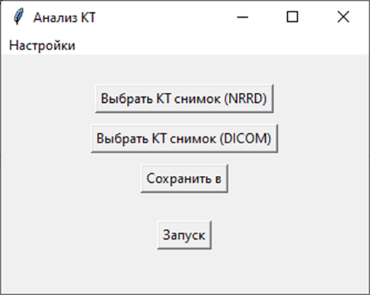
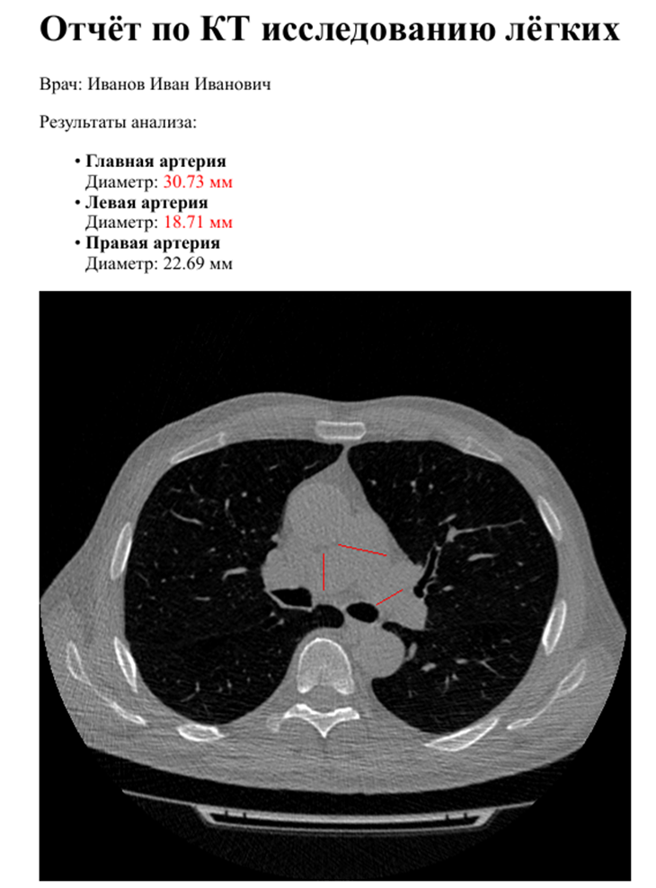

# Pulmonary Artery Analysis

An end-to-end application for automatic pulmonary artery diameter measurement from chest CT scans.

The project combines deep learning and classical computer vision techniques to automatically identify pulmonary arteries, estimate their diameters and generate a structured PDF report for clinical review.

Unlike end-to-end regression approaches, the system decomposes the problem into several independent processing stages. This makes the pipeline easier to validate, extend and adapt to other medical imaging tasks.

---

## Overview

The application processes a chest CT study (DICOM or NRRD) through a sequence of specialized components.

```text
CT Scan (DICOM / NRRD)
        │
        ▼
Slice Classification
        │
        ▼
Pulmonary Artery Segmentation
        │
        ▼
Artery Clustering
        │
        ▼
Centerline Extraction
        │
        ▼
Diameter Measurement
        │
        ▼
    PDF Report
```

Each stage solves a well-defined problem and can be developed or replaced independently from the rest of the pipeline.

---

## Pipeline

### Slice classification

A fine-tuned **ResNet50** model identifies CT slices containing pulmonary arteries, reducing the amount of data processed by subsequent stages.

### Vessel segmentation

A **SegNet** model performs semantic segmentation of the pulmonary arterial tree.

### Artery clustering

The segmented vascular structure is separated into the three major pulmonary arteries that are analyzed independently.

### Diameter estimation

Rather than predicting vessel diameters directly with a neural network, the project estimates them geometrically.

The algorithm extracts the vessel centerline using skeletonization, computes local vessel orientation using Principal Component Analysis (PCA), constructs perpendicular cross-sections along the artery and measures local diameters from the segmentation mask.

This approach provides an interpretable and extensible measurement pipeline while keeping deep learning focused on perception tasks.

### Report generation

The final measurements are exported as a PDF report containing:

- measured diameters;
- CT slice used for measurement;
- visualization of detected diameters.

---

## Architecture

The project follows a modular architecture where every processing stage is implemented as an independent component.

```
Input
 ↓
Classification
 ↓
Segmentation
 ↓
Clustering
 ↓
Measurement
 ↓
Reporting
```

This separation keeps responsibilities isolated and allows individual algorithms or neural networks to be replaced without affecting the rest of the application.

---

## Technologies

### Machine Learning

- PyTorch
- TorchVision
- ResNet50
- SegNet

### Computer Vision

- OpenCV
- scikit-image
- SimpleITK

### Reporting & UI

- Jinja2
- WeasyPrint
- Tkinter

---

## Model Performance

### Slice Classification

| Metric | Validation | Patient-level Validation |
|---------|-----------:|-------------------------:|
| Precision | 0.899 | 0.903 |
| Recall | 0.810 | 0.814 |

### Segmentation

| Metric | Validation |
|---------|-----------:|
| IoU | 0.70 |

### End-to-End Measurement Accuracy

| Metric | Validation | Test |
|---------|-----------:|-----:|
| Absolute error | 3.34 mm | 4.88 mm |
| Relative error | 13.3% | 19.0% |


---

## Gallery

### Application



### Generated Report




## Running

Clone the repository and run the application.

```bash
git clone ...
cd pulmonary-artery-analysis
poetry init
python main.py
```

The application accepts CT studies in **DICOM** and **NRRD** formats.

---

## Future Work

Potential improvements include:

- 3D segmentation;
- improved artery clustering;
- automatic quality assessment of measurements.
